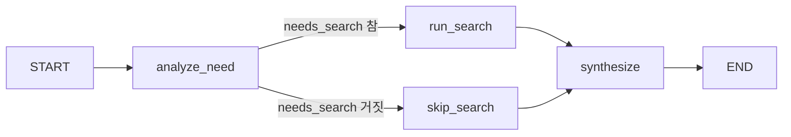

# hello-langgraph

LangGraph를 사용한 **교육(Education) 에이전트** 예제 프로젝트입니다. 학습자 질문에 대해 웹 검색이 필요한지 판단하고, 필요 시 외부 검색 도구로 자료를 모은 뒤 한국어로 답변을 만듭니다.

## 환경 준비

- Python 3.13 이상 (`.python-version` 참고)
- [uv](https://github.com/astral-sh/uv) 권장

```bash
uv sync
```

프로젝트 루트에 `.env` 파일을 두고 OpenAI API 키를 설정합니다.

```env
OPENAI_API_KEY=sk-...
```

## 실행 방법

Jupyter에서 `main.ipynb`를 열고 **위에서 아래 순서**로 셀을 실행합니다.

1. 환경 및 `ChatOpenAI` 초기화
2. (마크다운) 과제 요구사항 요약
3. Education Agent 그래프 정의 및 컴파일
4. `EDU_QUESTION`을 바꿔 `education_app.invoke(...)` 실행

---

## Education Agent 설명

### 역할

- 사용자 질문(`user_question`)을 받아 **검색이 필요한지** 먼저 분류합니다.
- 검색이 필요하면 **DuckDuckGo 텍스트 검색** 도구로 관련 웹 결과를 요약해 상태에 넣고, 필요 없으면 검색 단계를 건너뜁니다.
- 마지막 노드에서 질문과 검색 결과(또는 “검색 생략” 표시)를 바탕으로 **교육용 답변**을 생성합니다.

### 과제 필수 요구 충족

| 요구사항 | 구현 내용 |
|----------|-----------|
| 노드 3개 이상 | `analyze_need`, `run_search`, `skip_search`, `synthesize` (총 4노드) |
| 조건부 엣지 1개 이상 | `analyze_need` 이후 `needs_search` 여부에 따라 `run_search` 또는 `skip_search`로 분기 |
| 도구(Tool) 1개 이상 | `educational_web_lookup` — `duckduckgo-search` 기반 웹 검색 |

### 상태(`EducationState`)

| 필드 | 설명 |
|------|------|
| `user_question` | 학습자 질문 |
| `needs_search` | 웹 검색 필요 여부 (라우터 노드에서 설정) |
| `search_query` | 실제 검색에 사용할 쿼리 |
| `search_results` | 도구 검색 결과 텍스트 또는 생략 메시지 |
| `final_answer` | 에이전트가 생성한 최종 답변 |

### 그래프 흐름



### 의존성 참고

- **LLM**: `langchain-openai` (`gpt-4o-mini` 등, 노트북에서 지정)
- **그래프**: `langgraph`
- **검색 Tool**: `duckduckgo-search` (패키지 경고 메시지가 나와도 검색 기능은 동작할 수 있음)

검색 노드는 네트워크 접근이 필요합니다.
